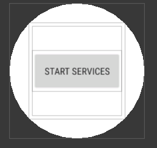
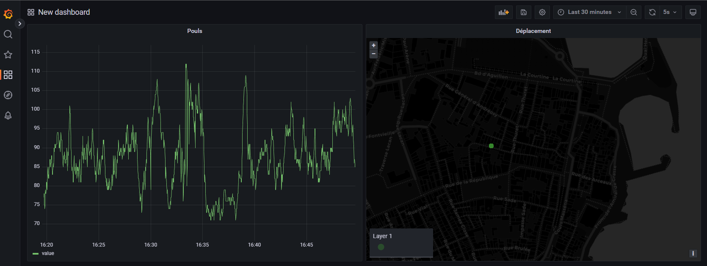

# Projet CLSW

- Yann Clodong
- Tom Niget
- Emmeline Vouriot

## Application

Sur la montre, une seule activité :



Le bouton permet de lancer un service qui s'exécute en fond et récupère les données de capteurs :
- GPS
- Baromètre
- Pouls

Les données sont envoyées sur un backend hébergé sur notre serveur. La série temporelle est stockée
dans une BDD PostgreSQL.

## Frontend

Grafana est utilisé pour la visualisation des données. Le service se connecte directement à la BDD
PostgreSQL pour récupérer les valeurs et les afficher.

En effet, nous sommes arrivés à la conclusion qu'il était plus pertinent dans le cadre de ce projet
de se reposer sur une solution de visualisation existante et éprouvée par le temps. Grafana permet
la création de dashboards et de règles automatiques très extensibles, ce qui correspond à nos besoins.

Le résultat :



## Installation

Le backend à proprement parler consiste en les deux fichiers PHP du dossier backend. Il faut modifier db.php pour entrer les coordonnées du serveur PostgreSQL.

L'application se trouve dans le dossier ProjetCLW ; il faut modifier dans GpsSensorService.kt ligne 77 l'URL publique du backend une fois celui-ci installé. 

Une fois le backend installé, la visualisation se fait avec Grafana, installable via APT ou Docker, configuré sur une data source PostgreSQL.

Exemple de requête :

```sql
select date, value::float from data where sensor='bpm'
```

Résultat :


