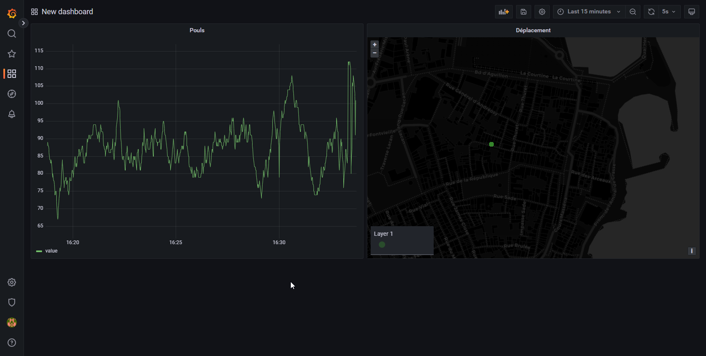

# Projet CLSW

- Yann Clodong
- Tom Niget
- Emmeline Vouriot

## Application

Sur la montre, une seule activité :

Le bouton permet de lancer un service qui s'exécute en fond et récupère les données de capteurs :
- GPS
- Baromètre
- Pouls

Les données sont envoyées sur un backend hébergé sur notre serveur. La série temporelle est stockée
dans une BDD PostgreSQL.

## Frontend

Grafana est utilisé pour la visualisation des données. Le service se connecte directement à la BDD
PostgreSQL pour récupérer les valeurs et les afficher.

En effet, nous sommes arrivés à la conclusion qu'il était plus pertinent dans le cadre de ce projet
de se reposer sur une solution de visualisation existante et éprouvée par le temps. Grafana permet
la création de dashboards et de règles automatiques très extensibles, ce qui correspond à nos besoins.

Le résultat :

